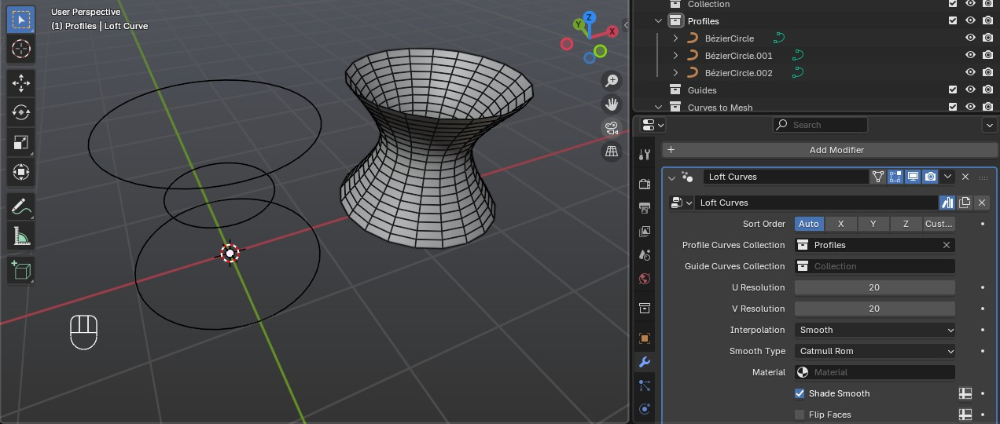
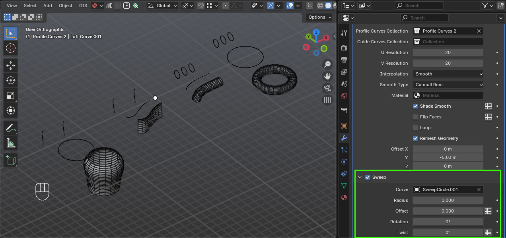
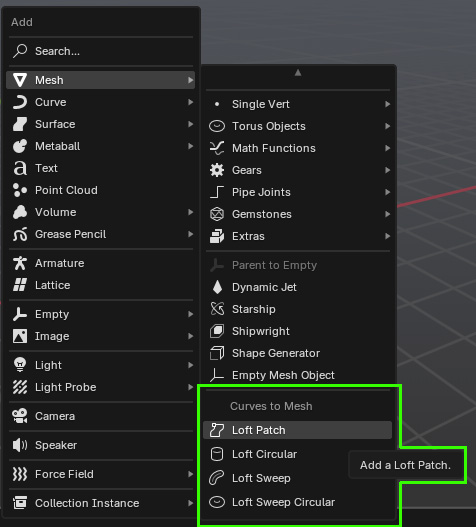
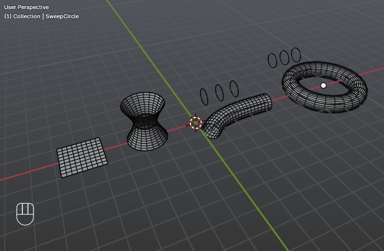

Getting Started
=============================================  

.. contents:: Sections
   :local:
   :depth: 2
   :backlinks: none

This guide will walk you through installing the add-on and creating your first lofted surface.

.. note::
   This add-on requires **Blender 4.5 or higher**.

Installation
------------

.. image:: ./_static/images/installation.gif
   :align: center
   :width: 600px
   :alt: Installation

You can simply **drag and drop the supplied curves_to_mesh.zip file** into Blender 4.5 or above.

Once installed, the tools will appear in the **N-panel** under the *Loft Curves* section.

.. image:: ./_static/images/curves_to_mesh_panel.jpg
   :align: center
   :width: 600px
   :alt: N-panel

.. raw:: html

     

Your First Loft
---------------

#. Add two **Bezier curves**:

   #. Press :kbd:`Shift+A → Curve → Bezier`.
   #. Move one along the Y-axis.
   #. Duplicate it with :kbd:`Shift+D` and move it again.

   .. image:: ./_static/images/two_beziers.jpg
      :align: center
      :width: 600px
      :alt: N-panel

#. Select both curves and press :kbd:`M` to move them into a new collection named ``Profiles``.

    .. image:: ./_static/images/move_to_profiles_col.jpg
       :align: center
       :width: 600px
       :alt: Profiles Collection

#. In the **Create** section of the add-on panel:

   #. Set **Profiles Collection** to ``Profiles``.
   #. You can also optionally set a **Guides Collection** or a **Sweep Curve**.
   #. Click **Loft Curves**.

   .. image:: ./_static/images/create_panel.jpg
      :align: center
      :width: 600px
      :alt: Loft Curves

#. A new object called **Loft Curve** is created in the *Loft Curves* collection.

   #. For clarity, press :kbd:`N` to hide the side panel.
   #. Use the **Modifier tab** to adjust its parameters.

   .. image:: ./_static/images/modifier_tab.jpg
      :align: center
      :width: 600px
      :alt: Lofted Object

.. tip::

    I also use the *Offset* setting on the modifier tab to move the object out of the way so I can see the curves more clearly.

    .. image:: ./_static/images/modifier_offset.jpg
       :align: center
       :width: 600px
       :alt: Lofted Object

Editing Profiles and Guides
---------------------------

* Select one or more profile curves, press :kbd:`Tab` to enter **Edit Mode**, and move vertices.  
  The loft object updates interactively.

  .. image:: ./_static/images/moving_vertices.gif
     :align: center
     :width: 600px
     :alt: Edit Mode

* To add **Guide Curves**:

  #. Duplicate your profile curves (:kbd:`Shift+D`).
  #. Move them into a new collection named ``Guides``.
  #. Enable snapping with the magnet icon at the top of the viewport and select **Vertex Snapping** from the dropdown.
  
      .. image:: ./_static/images/snapping_vertices.jpg
         :align: center
         :width: 600px
         :alt: Vertex Snapping

  #. Snap vertices of these curves so they align with corresponding points on the profile curves:

      .. image:: ./_static/images/guide_curves.jpg
         :align: center
         :width: 600px
         :alt: Snapping Vertices

  #. In the loft object’s **Modifier tab**, set the **Guide Curves Collection**.  The object should update so that the loft is controlled by the guide curves as well as the profiles.

      .. image:: ./_static/images/set_guide_curves.jpg
         :align: center
         :width: 600px
         :alt: Guides Collection

.. important::
   * You can have multiple guide curves along profiles. 
   * Guide curves **must snap to existing points** on the profile curves.  
   * If needed, subdivide the profiles first to create snap points.

   .. image:: ./_static/images/multiple_guides.jpg
      :align: center
      :width: 600px
      :alt: Subdivide Profiles

Cyclic Curves
-------------

Cyclic (closed) curves such as circles are also supported.

1. Add a **Circle curve** (:kbd:`Shift+A → Curve → Circle`).  
2. Move it into a collection (e.g. ``Circle Profiles``) and duplicate it.  
3. In the panel, set **Profiles Collection** to your circle collection.  
4. Click **Loft Curves** to generate a lofted object.  
5. Optionally, add **Guide Curves** in the same way as linear ones.

    .. image:: ./_static/images/cyclic_guides.jpg
       :align: center
       :width: 600px
       :alt: Snapping Vertices

Sweep Curves
------------

In addition to profile and guide curves, you can also specify a **Sweep Curve**.  
This deforms the lofted surface along the shape of another curve.

#. Create a lofted object with profile curves as before:

    .. image:: ./_static/images/sweep_loft_1.jpg
       :align: center
       :width: 600px
       :alt: Sweep Curves

#. Tick the *Sweep* option in the modifier of the lofted object, and select the sweep curve which can be cyclic or non-cyclic:

    .. image:: ./_static/images/sweep_pick.jpg
       :align: center
       :width: 600px
       :alt: Sweep Modifier

#. Once the sweep curve has been picked you should see the object deform along it:

    .. image:: ./_static/images/sweep_picked.jpg
       :align: center
       :width: 600px
       :alt: Swept Loft

You can assign a sweep curve in two places:

- **During creation**: In the add-on panel’s **Create** section, set the *Sweep Curve* field.  
- **After creation**: In the loft object’s **Modifier tab**, set or change the *Sweep Curve* there.

A sweep curve can be either:

- **Cyclic** (closed, e.g. a circle)  
- **Non-cyclic** (open, e.g. a bezier line or custom curve)  

When a sweep curve is active, the generated loft surface is wrapped or deformed along that curve, making it useful for pipes, rings, or flowing surfaces that follow a path.

Helper Objects
--------------

The add-on also provides ready-made helper objects:

- **Add → Loft Patch**  
  Creates a simple lofted patch with both profiles and guide curves ready to edit.  

- **Add → Loft Circular**  
  Creates a patch with only cyclic profile curves.  

- **Add → Loft Sweep**  
  Creates a patch with profile curves and a sweep curve.  

- **Add → Loft Sweep Circular (Curves only)**  
  Creates a patch with cyclic profile curves and a cyclic sweep curve.

These helpers are a fast way to start experimenting.

Next Steps:
----------------------------------------

- Explore the modifier settings on the generated loft object.  
- Edit, duplicate, and subdivide curves to refine your surface.  
- Experiment with your own curve setups.  
- Report any bugs or unexpected behaviour during testing.  

.. note::
   Tooltips have been added to the UI for quick reference while using the add-on.
