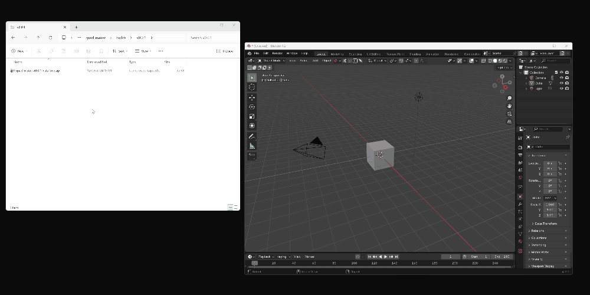

.. _installation:

#############
Installation
#############

.. note::

   If you have any issues do not hesitate to get in touch via `info@configurate.net <mailto:info@configurate.net>`_.

You can simply **drag and drop the downloaded loft_curves.zip file** into Blender 4.5 or above.

Once installed, the tools will appear in the **N-panel** under the *Loft Curves* section.

