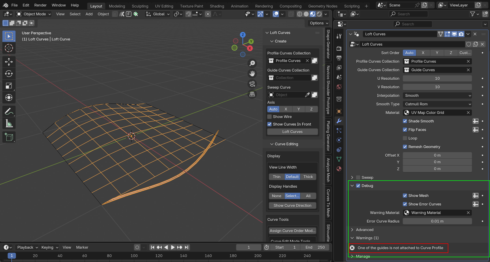
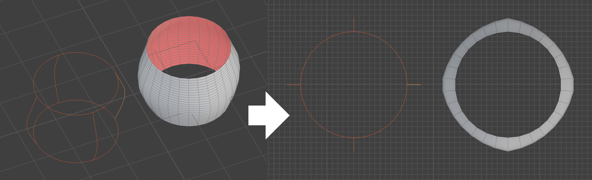
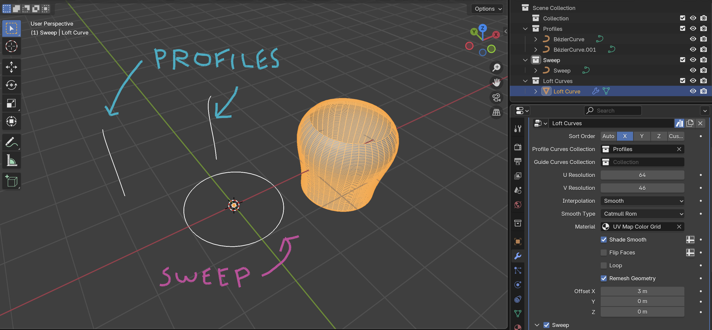

#####################################
Tips and Troubleshooting
#####################################

.. note::
    
    If you are having any issues do not hesitate to :ref:`Contact Us <contact>`

----------
Debug Mode
----------

If you encounter any warnings (seen in red in the screenshot here) or are finding some of the curves do not align, you can enable Debug Mode in the modifier settings (shown in green). 

This will add extra visual guides to help you identify and fix any issues. It will:

* Turn the surface into a wireframe to see more clearly.
* Show any misaligned guide curves as a thickened cylinder with a red material.

.. tip:: 

    .. image:: _static/images/shading_preview.jpg
        :alt: Debug Mode Tip

    Make sure you are in either *Solid* or *Material Preview* view modes to see the debug visualisations.

------------------------------------------------------------------------------------------------------------------------------------------------
The guide curves don’t interpolate as expected on cylindrical lofts — what’s happening?
------------------------------------------------------------------------------------------------------------------------------------------------

When creating cylindrical or circular lofts, guide curves can sometimes behave unexpectedly — for example, the surface may appear uneven between profiles.
This happens because guide interpolation follows the shortest path between corresponding vertices on each profile, which can become ambiguous around circular shapes.

*Workaround:* Instead of using guide curves around a cylinder, try using the side of the cylinder as a profile and pair it with a circular sweep curve.
This approach produces a clean, predictable result while preserving the circular shape and curvature you expect.

