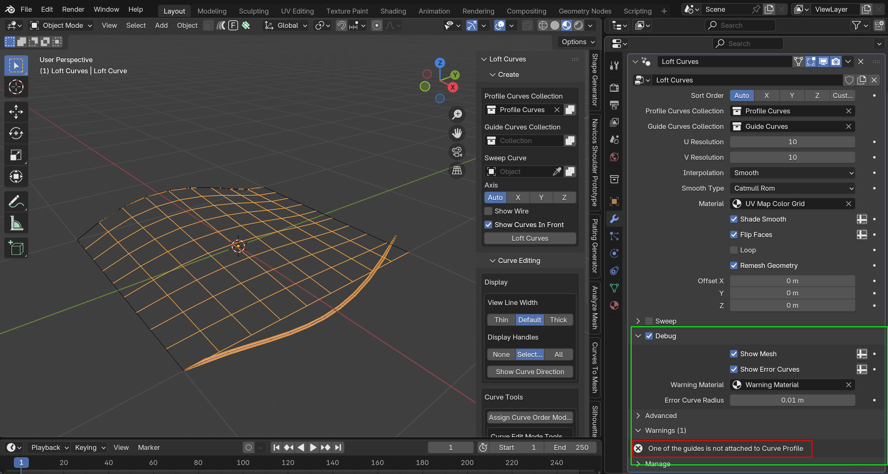
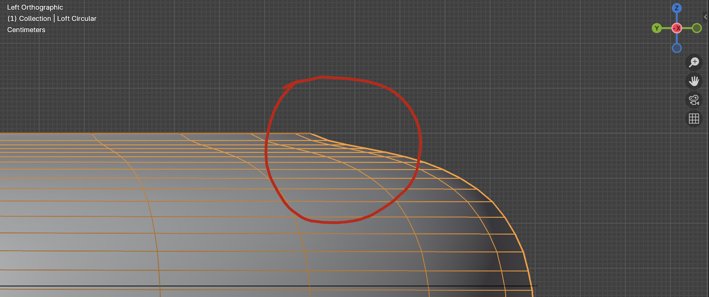
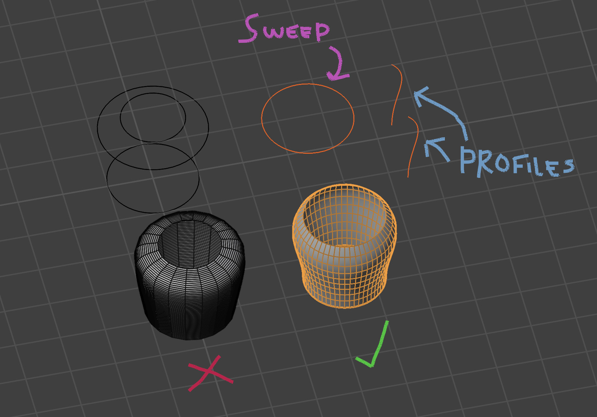
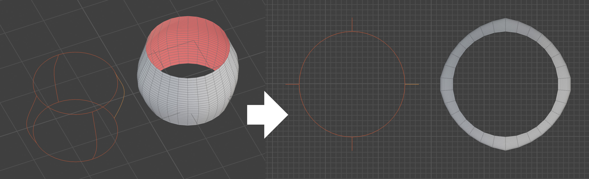
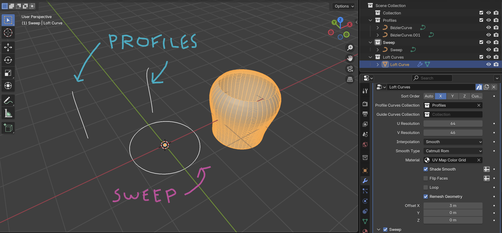

#####################################
Tips and Troubleshooting
#####################################

.. note::
    
    If you are having any issues do not hesitate to :ref:`Contact Us <contact>`

----------
Debug Mode
----------

If you encounter any warnings (seen in red in the screenshot here) or are finding some of the curves do not align, you can enable Debug Mode in the modifier settings (shown in green). 

This will add extra visual guides to help you identify and fix any issues. It will:

* Turn the surface into a wireframe to see more clearly.
* Show any misaligned guide curves as a thickened cylinder with a red material.

.. tip:: 

    .. image:: _static/images/shading_preview.jpg
        :alt: Debug Mode Tip

    Make sure you are in either *Solid* or *Material Preview* view modes to see the debug visualisations.

------------------------------------------------------------------------------------------------------------------------------------------------
My curves don't seem to be affecting the lofted surface — what am I doing wrong?
------------------------------------------------------------------------------------------------------------------------------------------------

Here are some common issues to check if your curves aren't affecting the lofted surface as expected.  If yoiu are still having issues, please :ref:`Contact Us <contact>`.

* **Check Curve Types**: Ensure that your curve is actually a curve type.  You can check this in the Object Data Properties tab (orange square icon) in the Properties panel:

    .. image:: _static/images/check_curve_type.jpg
        :alt: Curve Type
        :width: 600px

    A curve object shows a squiggly curve icon.  If it shows a triangle icon, it is a mesh object and will not work with the add-on. To convert a mesh to a curve, select the object, Right-click in the *3D Viewport → Convert To ➝  Mesh*.

* **Check if there are modifiers on the curve**: If there are any modifiers on the curve object, try applying or removing them to see if that resolves the issue.  Some modifiers (e.g. Mirror) can change the curve data to mesh data that cannot be processed.  Instead, consider adding the modifier to the lofted surface itself — or enable **Convert to Curves** in the loft object's modifier tab, which automatically handles mesh inputs.  See :ref:`using-mirror-modifier` for more detail.

* **Make sure the curve is a 3D curve not a 2D curve**: In the Object Data Properties tab in the Properties panel, ensure that the *2D/3D* option is set to *3D*:

    .. image:: _static/images/check_curve_3D.jpg
        :alt: 3D Curve
        :width: 600px

    A 2D curve will only work in the XY plane and will not affect the lofted surface as expected.

* **Make sure curve is in the correct collection**: The add-on looks for curves in the specified collection on the modifier. Make sure your curves are in this collection.

If you are still having issues, please :ref:`Contact Us <contact>`.

.. _using-mirror-modifier:

------------------------------------------------------------------------------------------------------------------------------------------------
I have modifiers on my curves — why isn't the loft generating correctly?
------------------------------------------------------------------------------------------------------------------------------------------------

Certain modifiers in Blender work on mesh data, not curve data.  When applied to a curve object they convert it to a mesh behind the scenes, which the add-on cannot process as a curve.  The most common case is the **Mirror modifier**, but the same issue can occur with other modifiers that output mesh geometry.  The same problem can also arise if you manually mirror curve halves using :kbd:`Ctrl-M` and the resulting geometry is read back as mesh data rather than a curve.

The quickest fix is to enable **Convert to Curves** in the loft object's modifier settings:

.. image:: _static/images/convert_to_curves_option.jpg
    :alt: Convert to Curves option
    :width: 600px

This automatically converts any mesh data in the input collections to curves before lofting, so the geometry is handled correctly without any manual steps.

Alternatively, there are two other workarounds:

* **Add a Mirror modifier to the Loft Curves object itself**: Instead of mirroring the individual curve objects, add a **Mirror modifier** to the loft object *after* the Loft Curves modifier in the modifier stack.  This keeps the curves as pure curve data and lets the loft generate cleanly, with the mirror applied to the finished surface.

  .. image:: _static/images/loft_curve_and_mirror_modfier.jpg
      :alt: Mirror modifier on the Loft Curves object
      :width: 600px

* **Add a Mesh to Curve node to each curve object**: Add a **Geometry Nodes** modifier directly on each affected curve object containing a single *Mesh to Curve* node.  This pre-converts the mesh data back to curve data before it reaches the loft modifier.

  .. image:: _static/images/loft_curve_mirror_mesh_to_curve_node_example.jpg
      :alt: Mesh to Curve node on a curve object
      :width: 600px

.. tip::

   Placing a **Mirror modifier** on the loft object itself (after the Loft Curves modifier) is often the cleanest non-destructive approach, as it keeps your curve objects untouched and avoids any conversion step entirely.

------------------------------------------------------------------------------------------------------------------------------------------------
My profile curves are not tapering at the end correctly - what's happening?
------------------------------------------------------------------------------------------------------------------------------------------------

You may notice that the lofted surface does not taper correctly at the ends of the profiles in some cases. This is due to how the smoothing interpolation works for Blender curves.  A workaround is to instead use a profile curve along the side and then to use a sweep curve instead:

------------------------------------------------------------------------------------------------------------------------------------------------
The guide curves don’t interpolate as expected on cylindrical lofts — what’s happening?
------------------------------------------------------------------------------------------------------------------------------------------------

When creating cylindrical or circular lofts, guide curves can sometimes behave unexpectedly — for example, the surface may appear uneven between profiles.
This happens because guide interpolation follows the shortest path between corresponding vertices on each profile, which can become ambiguous around circular shapes.

*Workaround:* Instead of using guide curves around a cylinder, try using the side of the cylinder as a profile and pair it with a circular sweep curve.
This approach produces a clean, predictable result while preserving the circular shape and curvature you expect.

